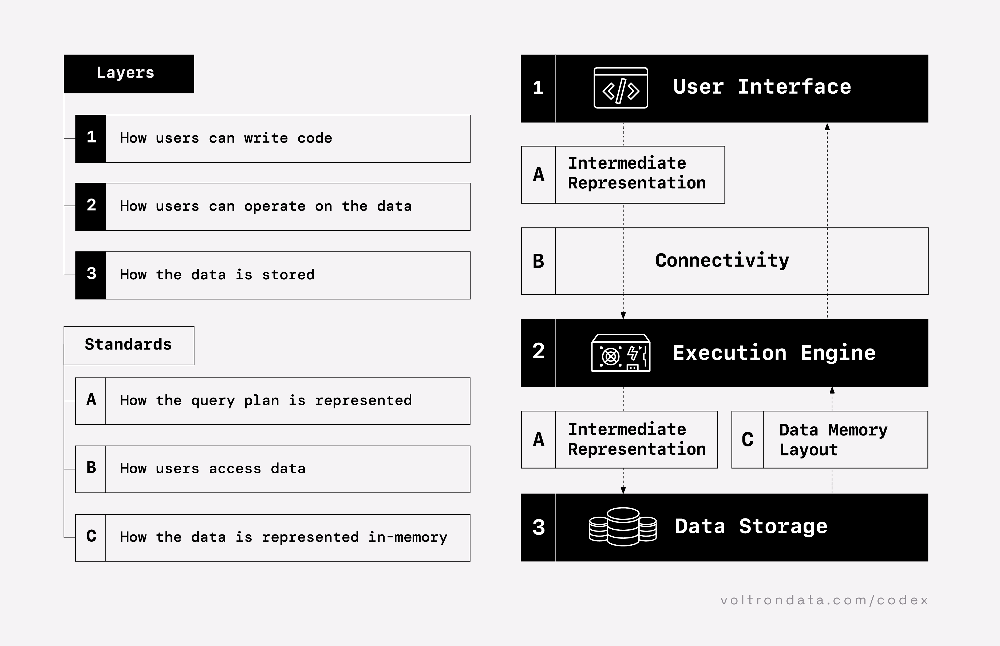

# Python analytics accelerator

***A composable data system in a Python package.***



This project uses:

1. **User interface**: Ibis (Python dataframe code and/or SQL)
2. **Execution engine**: DuckDB (local) and ClickHouse (remote)
3. **Data storage**: Delta Lake tables (local and/or cloud storage)

You can mix and match these components as needed.

> [!CAUTION]
> This accelerator is not necessarily production-ready, but might be a good starting point. For now, it is primarily intended as an educational resource.

## setup

Get up and running in 5 steps.

### 1. install

Install:

```bash
pip install python-analytics-accelerator
```

> [!TIP]
> This makes the `acc` CLI available as long as you have a Python environment with the package installed active. Type `acc` in your terminal to see available commands.

### 2. initialize

Initialize:

```bash
acc init
```

> [!TIP]
> Edit the `config.py` file to the GitHub repository and PyPI package you want to analyze.

> [!IMPORTANT]
> You must edit the `.env` to add your GitHub token or otherwise set `GITHUB_TOKEN` as an environment variable.
>
> You can use `gh auth token` to print your GitHub token if you have the GitHub CLI installed.

### 3. ingest

Ingest from external sources:

```bash
acc ingest
```

### 4. run data DAG

Run data DAG:

```bash
acc run
```

### 5. dashboard

Open dashboard:

```bash
acc dashboard
```

## development

Clone and change into the repository:

```bash
gh repo clone lostmygithubaccount/python-analytics-accelerator
cd python-analytics-accelerator
```

Install:

```bash
pip install -r requirements.txt
```

Format your code:

```bash
ruff format .
```

## contributing

Work in progress, contributions welcome. Please consider asking before substantial changes in these early days.
